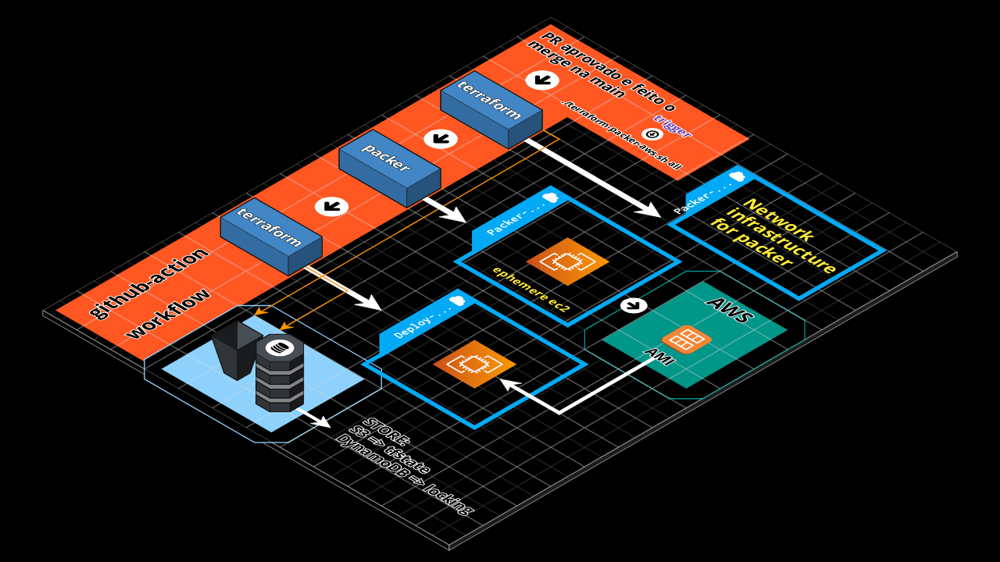
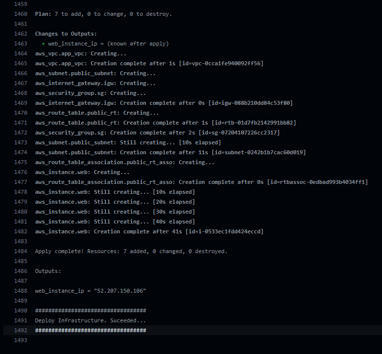
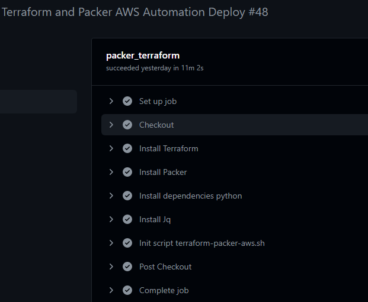
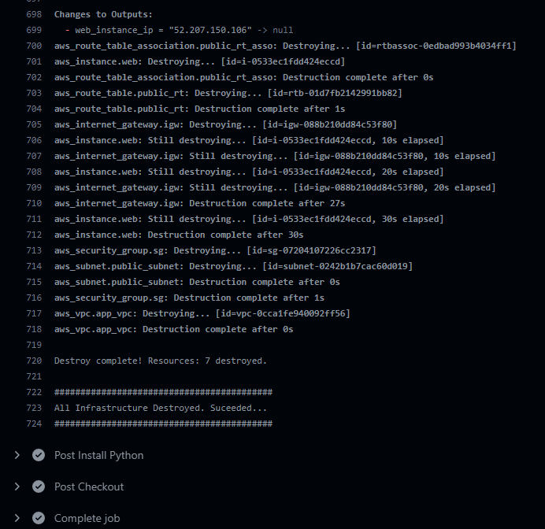
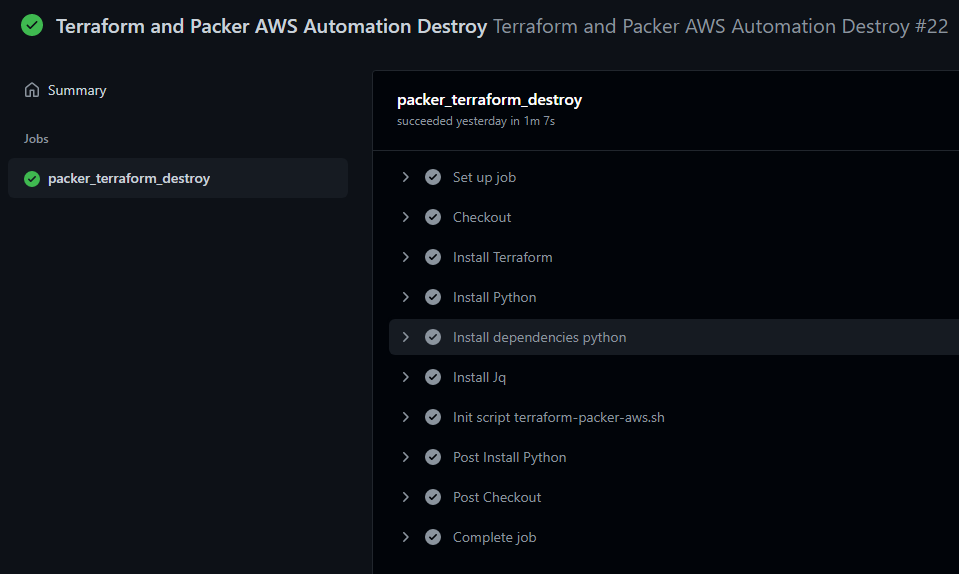

[](https://infrati.dev)

### Projeto terraform packer aws utlizando o github action, sendo acionado via PR

### Contents 
  - [scripts](scripts/)
  - [terraform-packer-build-aws](terraform-packer-build-aws/)
  - [terraform-packer-deploy-aws](terraform-packer-deploy-aws/)
  - [terraform-packer-network-aws](terraform-packer-network-aws/)

### Projeto terraform packer aws com github-action



- Esse projeto será executado utlizando o github-action. Projeto foi criado para ser executado localmente também nesse repositório [terraform-packer-aws](https://github.com/infratidev/terraform-packer-aws)
- PR sendo aprovado e feito o merge na branch main em uma ```única ação```, ao executar ```./terraform-packer-aws.sh``` com o parâmentro ```all``` ```./terraform-packer-aws.sh all``` será executado:
    - Através do terraform, o provisionamento da infraestrutura de rede para o packer realizar o build utilizando a AWS.
    - Após infraestrutura de rede pronta, o packer irá realizar o build da imagem na AWS utilizando a infraestrutura de rede específica, onde será executado o script ```userdata.sh``` instalando um servidor apache.
    - AMI criada e disponível na AWS, será provisionado com o terraform uma infraestrutura nova para deploy de uma ec2 com a imagem criada pelo packer.
    - tfstate da infraestrutura de network e deploy estão separadas, utilizando S3 para armazenar o state e dynamoDB para locking.
    - Para que consigamos efetuar o destroy, através do ```manifest post-processor``` iremos criar o arquivo ```packer_manifest.json``` com a lista de todos os artefatos que o packer produziu durante a execução. No processo de ```deploy``` armazenamos no S3 e no processo de ```destroy ``` recuperamos do S3.

### Requiriments

* AWS_ACCESS_KEY_ID e AWS_SECRET_ACCESS_KEY cadastradas no github e parametrizadas na AWS com as pemissões para os recursos utilizados.
* Estrutura para remote state criada. Link para provisionar a estrutura: [Estrutura Remote State](https://github.com/infratidev/terraform-aws/tree/main/07-remote-state-packer-aws)

### Provisionamento

Abrir um PR, aprovar e efetuar o merge.

Ao final, será exibido na console.




Todas execuções:




### Remoção de toda infraestrutura criada, AMIs e snapshots

Acionamento manual do workflow

Ao final, será exibido na console.



Todas execuções:



<br>

[](https://infrati.dev)


